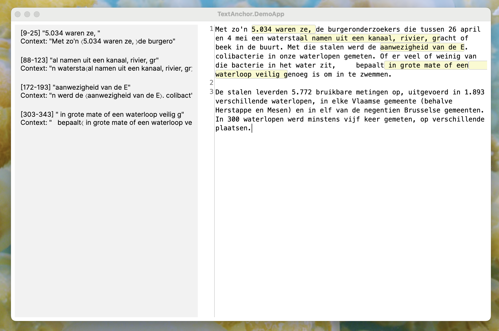

# TextAnchor

Library to manage annotations on top of plain-text files.

**TextAnchor** helps preserve and track annotations even when the underlying text changes — useful for qualitative coding and research.

Created for use in [CodexLite](https://github.com/designmatters/CodexLite).

## TODO

- Unit tests
- Implement diff-based editing instead of context-based search.
